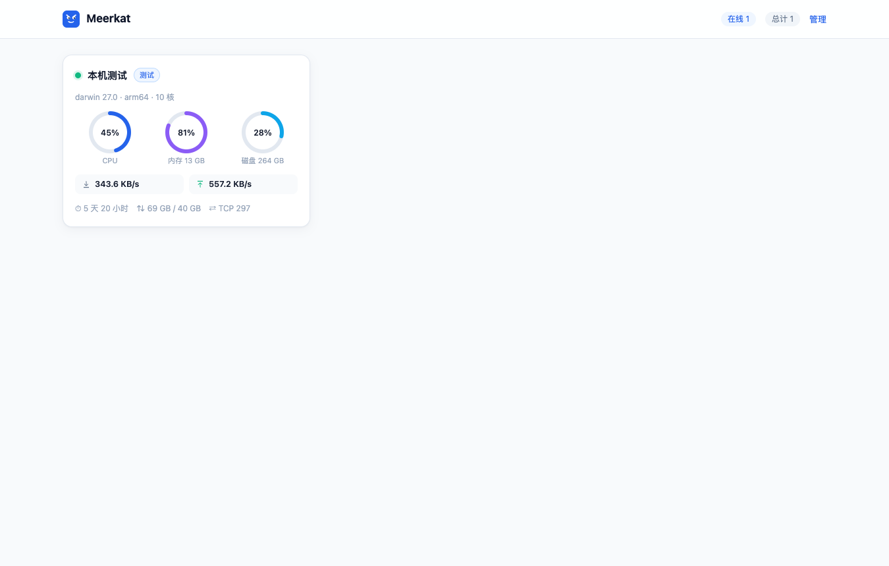
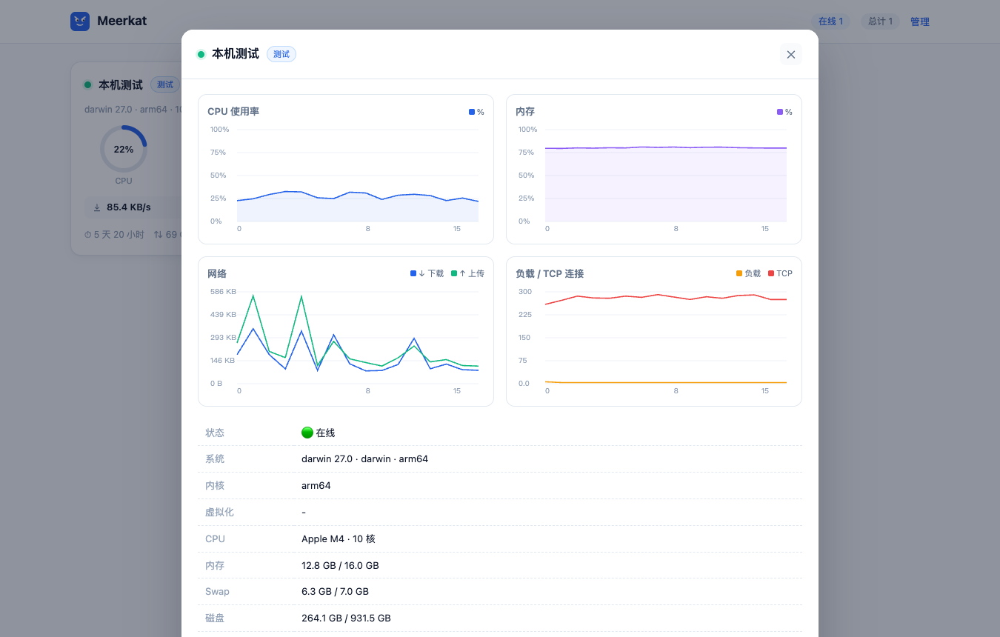
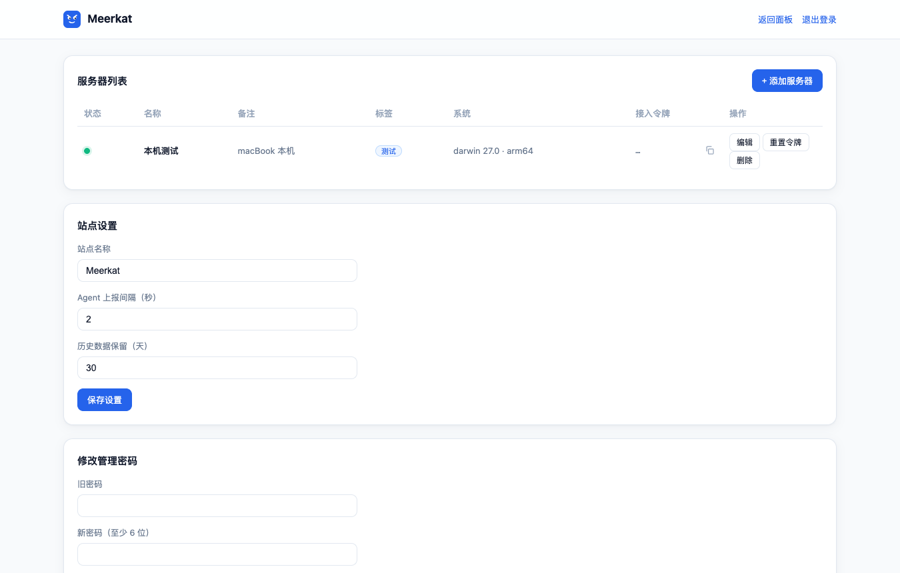

---
AIGC:
  ContentProducer: '001191110102MAD55U9H0F10002'
  ContentPropagator: '001191110102MAD55U9H0F10002'
  Label: '1'
  ProduceID: 'a5515018-e306-477b-b986-e400b1ba1696'
  PropagateID: 'a5515018-e306-477b-b986-e400b1ba1696'
  ReservedCode1: 'd4a058cc-f0d2-47bb-a1e2-46c11aa24bb9'
  ReservedCode2: 'd4a058cc-f0d2-47bb-a1e2-46c11aa24bb9'
---

# Meerkat

English | [简体中文](README.md)

<p align="center">
  
</p>

**Meerkat** (the born sentinel of the animal kingdom) is a lightweight, self-hosted server monitoring panel. Single-binary deployment, minimal resource footprint, and a real-time web dashboard for all of your servers.

> Inspired by the product philosophy of [Komari](https://github.com/komari-monitor/komari), this is a **fully independent, from-scratch implementation** — protocol, code, and UI are all original, built for self-hosters who prefer lightweight solutions and a zero-build frontend.

## Features

- **Real-time monitoring**: agents report every 2 seconds by default; WebSocket pushes updates to the panel instantly
- **Battery included**: single binary server, SQLite storage, and a zero-dependency, zero-build native JS frontend
- **Complete metrics**: CPU / memory / swap / disk / network speed & totals / load / TCP·UDP connections / process count / uptime
- **History charts**: minute-level aggregation persisted in SQLite, 30-day retention by default (configurable)
- **Server management**: token-based enrollment, tags, ordering, token rotation, copy-paste install commands
- **Secure**: agent tokens stored hashed, HttpOnly admin sessions, bcrypt password hashing
- **Cross-platform**: Linux / macOS / Windows (amd64 / arm64 / arm), with Docker support
- **One-line install**: the panel serves an install script; paste one command on any target host (auto-registers systemd / launchd service)

## Screenshots

| Home | Details | Admin |
| --- | --- | --- |
|  |  |  |

## Quick Start

### Server via Docker

```bash
git clone https://github.com/zhanghaobo1987/meerkat-monitor.git
cd meerkat-monitor
docker compose up -d
```

Or with a binary:

```bash
# Download the archive for your platform and extract the `meerkat` binary
./meerkat server --listen :8080 --db ./data/meerkat.db
```

On first start, a random admin password is printed to the log (username: `admin`). Log in at `http://<your-host>:8080/admin` and change it immediately.

### Enroll a server & install the agent

1. Open **Admin → Servers → Add server**, copy the enrollment token
2. Run the install command shown in the panel on the target host:

```bash
curl -fsSL http://<your-panel-host>:8080/install.sh | bash -s -- \
  -e http://<your-panel-host>:8080 -t <token>
```

The script detects platform/arch, downloads the matching release, and registers a persistent `systemd` (Linux) or `launchd` (macOS) service.

#### One-line install on Ubuntu

```bash
curl -fsSL http://<panel-host>:8080/install.sh | bash -s -- -e http://<panel-host>:8080 -t <token>
```

Works on Ubuntu 20.04 / 22.04 / 24.04, both amd64 and arm64. The script:

1. Detects the platform (`uname -m` → amd64/arm64)
2. Downloads the agent binary (panel-served first, see below; falls back to GitHub Releases)
3. Installs it to `/usr/local/bin/meerkat`
4. Writes `/etc/meerkat/agent.env` (mode 600)
5. Registers and starts the `systemd` service `meerkat-agent` (auto-start on boot, auto-restart on crash)

After installation:

```bash
systemctl status meerkat-agent        # status
journalctl -u meerkat-agent -f        # live logs
sudo systemctl restart meerkat-agent  # restart (e.g. after token rotation)
```

To uninstall:

```bash
sudo systemctl disable --now meerkat-agent
sudo rm /etc/systemd/system/meerkat-agent.service /etc/meerkat/agent.env /usr/local/bin/meerkat
sudo systemctl daemon-reload
```

#### Agent binary served by the panel (recommended for private repos / offline)

The installer downloads the agent binary **from the panel itself first**, with no GitHub dependency. Place the binaries once on the panel host (under the `agents/` subdirectory next to the database):

```bash
# With the database at ./data/meerkat.db, put binaries in ./data/agents/
mkdir -p data/agents
```

Then place the platform binaries there (keep names like `meerkat_linux_amd64`), either way:

- **Option A (simplest)**: log in to GitHub in a browser, download `meerkat_linux_amd64` (raw binary, no extraction) from the [Releases page](https://github.com/zhanghaobo1987/meerkat-monitor/releases), and scp/SFTP it to the panel's `data/agents/`
- **Option B (CLI)**:

```bash
TOKEN="<your GitHub PAT>"; REPO="zhanghaobo1987/meerkat-monitor"
mkdir -p data/agents
AID=$(curl -fsSL -H "Authorization: Bearer $TOKEN" "https://api.github.com/repos/$REPO/releases/latest" \
  | sed -n '/"name": "meerkat_linux_amd64",/{x;s/.*"id": \([0-9]*\).*/\1/p;d;}; /"id": /h')
curl -fL -H "Authorization: Bearer $TOKEN" -H "Accept: application/octet-stream" \
  -o data/agents/meerkat_linux_amd64 "https://api.github.com/repos/$REPO/releases/assets/$AID"
```

After that, every Ubuntu/Debian/CentOS host can install **fully offline** with the one-line command above. Add `meerkat_linux_arm64`, `meerkat_darwin_arm64`, etc. as needed.

#### Fallback: GitHub Releases

If the repo is **private**, release assets require authentication — export a PAT before running the installer:

```bash
export MEERKAT_GH_TOKEN=<your GitHub PAT>
curl -fsSL http://<panel-host>:8080/install.sh | bash -s -- -e http://<panel-host>:8080 -t <token>
```

No token is needed once the repo is public.

### Run the agent manually

```bash
./meerkat agent -endpoint http://<your-panel-host>:8080 -token <token>

# Or via environment variables
MEERKAT_ENDPOINT=http://host:8080 MEERKAT_TOKEN=xxx ./meerkat agent
```

## Build from Source

Requires Go ≥ 1.24 (no CGO needed):

```bash
make build          # current platform → dist/meerkat
make release-local  # cross-compile all platforms → dist/
```

## Architecture

```
┌──────────────┐  HTTP POST /api/agents/report (Bearer Token)
│ meerkat agent│ ────────────────────────────────────────────▶ ┌───────────────┐
│ (per server) │ ◀──────────────────────────────────────────── │ meerkat server│
└──────────────┘      response carries report interval         │ single binary │
                                                               │ SQLite store  │
   browser ── WebSocket /ws live push ◀──────────────────────▶ │ embedded web  │
   browser ── REST /api/public/* /api/admin/* ──────────────▶  └───────────────┘
```

- `internal/model` — wire protocol & shared types
- `internal/server` — storage / API / realtime hub / embedded assets
- `internal/agent` — metric collection (gopsutil) & report loop
- `web_dist` — native HTML/CSS/JS panel, packed via `go:embed`

## Security Notice

Meerkat is a self-hosted monitoring tool. Deploy it only on systems you own or are authorized to manage. Do not expose the panel to the public internet without protection; put it behind a reverse proxy with HTTPS.

## Roadmap

- [ ] Alerting (Webhook / Telegram / Email)
- [ ] Online terminal & file manager
- [ ] Theme system & theme market
- [ ] ICMP / TCP port probing
- [ ] Multi-user & read-only share links

## License

[MIT](LICENSE)

> AI生成